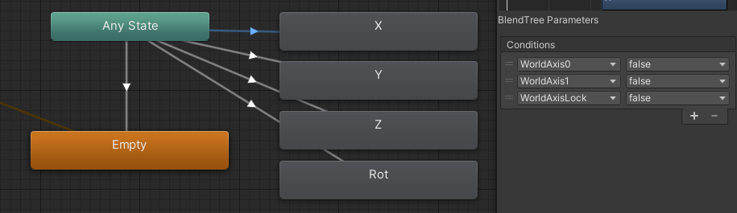
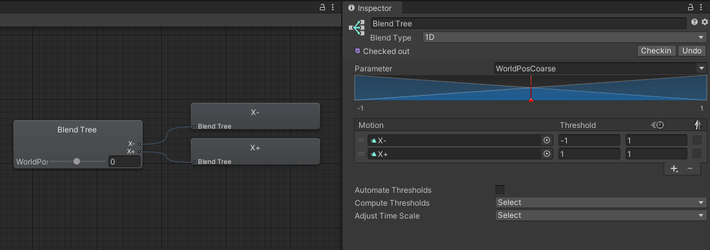
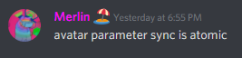
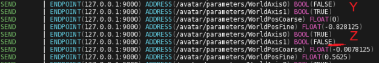
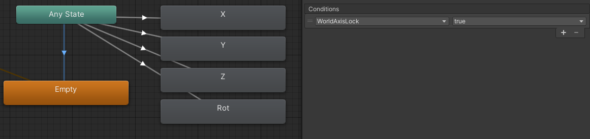

# Parameter Multiplexing

`vrc-worldobject` uses two float values, and 3 bool values, to transmit all 4 axes of the worldobject's position. (X, Y, Z, and rotation)
This document describes how that's done. Hopefully the information here will be useful to your projects.

I'm calling the technique "parameter multiplexing".
The basic idea is: rather than trying to put every parameter into your avatar parameters,
instead have only a couple of "value" parameters, and a couple of "selector" parameters that indicate what the value currently refers to.

## The Selector Bits

The selector bits choose the meaning of the value bits.

In `vrc-worldobject`, these bits are called `WorldAxis0` and `WorldAxis1`.
They're implemented as two booleans, because I only need to select between 4 different values.
The encoding is as follows:

```text
0, 0 => X
0, 1 => Y
1, 0 => Z
1, 1 => Rotation (y axis)
```

You could add additional bits to select between more values, or you could even use an `Int` parameter to make it easier, at the cost of using more available storage.

Here is what the animation layer looks like:



You may also notice the `WorldAxisLock` condition. We will cover that later, when we talk about The Lock Bit.

## The Values

Once we've made the state transition to the X axis, we reach a BlendTree that uses the `WorldPosCourse` parameter to blend between the two extremes of X axis movement.



There is a second animation layer that has the same transitions configured, and which does the same thing with the `WorldPosFine` parameter.

You could imagine having many different blendtrees, or even [sub-state machines](https://docs.unity3d.com/Manual/NestedStateMachines.html), that would take on different behaviors depending on the configuration of the selector bits.

## Retransmission for Late Joiners

When someone joins the world late, their game client will need the information about all 4 axes in order to place the WorldObject correctly.
However, we only have, at most, information about one axis loaded into avatar parameters at a given time.
This means that something on our end needs to be continuously switching and retransmitting the axis values, so that late joiners receive that data quickly.

In the TouchOSC file included in this project, there is code written to continuously cycle through each axis and keep everyone continuously up to date.

## The Race Condition

There's a problem with this technique as it's written out so far: it's still possible for VRChat networking to assign your values to the wrong parameters.

Avatar parameter sync is atomic. Don't believe me? Fine.



Ok, so it's settled. Avatar parameter sync is atomic.
This means that when parameters are synced, VRChat takes a snapshot of all parameters together, and sends them all out in a consistent state.

However, OSC updating multiple parameters is *not* atomic.
*That* means that if VRChat decides to take the snapshot of your parameters in the middle of you updating several of them, remote clients might receive an inconsistent picture.

Take the following as an example.



Let's go through this line by line.

1. Set the first selector bit to 0.
2. Set the second selector bit to 1. We've now selected the Y axis.
3. Set the coarse value for the Y axis.
4. Set the fine value for the Y axis. So far so good. The problem comes as we're setting up to update the Z axis...
5. Set the first selector bit to 1.
6. Set the second selector bit to 0. We've now selected the Z axis.

At this point, I drew a little red marker on the screenshot.
This is the moment where VRChat decides to take a snapshot of avatar parameters and send it to the other players.
We've selected the Z axis, but the position values in our parameters still belong to the Y axis.
This means that for all remote clients, we'll assign the Y axis value to the Z axis!

You might think this is a rare thing to happen, but it turns out, it happens enough to be extremely noticeable.

## The Lock Bit

The purpose of the lock bit is to tell us whether we have a fully consistent state or not.
When updating a parameter, the sequence of events should always be:

1. Set the lock bit to true, informing the animation controller that the state is about to become inconsistent.
2. Set the selector bits.
3. Set the values.
4. Set the lock bit to false, informing the animation controller that the state is consistent again.

Remember that `WorldAxisLock` parameter from the selector bits section earlier? That's our lock bit.
Any time we have an inconsistent state, we should always transition to an empty state to avoid corrupting anything.



## Conclusion and Contrubuting

Thank you for reading this far! I hope some of this was helpful in your projects.

Thanks also to Razgriz, Lyuma, and Merlin for all the great ideas and information that got this technique to this point.

I would love to hear your comments and suggestions!
I would ask that if you have a suggestion to make, please open a pull request with specific edits.

You can reach me at `Goat#5718` on Discord (though I go by `Oli__` in VRChat and in most VRC-related Discords).
